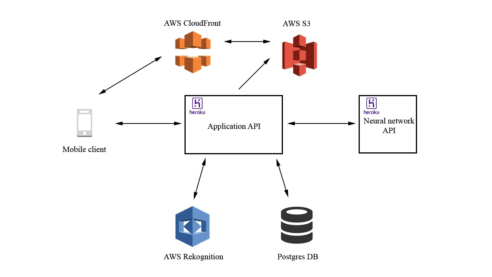

# GUESS description
## 1. Type
**GUESS** is an android application of a hybrid type. These are connected mobile and web cloud applications. The main advantages of hybrid applications are cross-platform on web-technologies and the ability to access the functions of a smartphone or other mobile device. Specifically, camera of the mobile device will be used with this application.
## 2. Deployment strategy
**Recreate** is a chosen strategy:
The recreate strategy is a dummy deployment which consists of shutting down version A then deploying version B after version A is turned off. This technique implies downtime of the service that depends on both shutdown and boot duration of the application.
This strategy has the following advantages and disadvantages:

Pros:
 - Easy to setup.
 - Application state entirely renewed.

Cons:
 - High impact on the user, expect downtime that depends on both shutdown and boot duration of the application.

## 3. Technology selection
### Android app
**QT creator and QML** was used to create an android application. 
### Backend
The following technologies were used to write the backend:
 - Spring boot
 - Hibernate
 - Swagger
 - PostgreSQL
 - Docker
 - Heroku
 - Amazon AWS

### Data processing part
For indentifying animals were used:
 - Tensorflow 
 - Falcon
 - Gunicorn
 - Docker

## 4. Quality indicators
Following quality indicators are major for current app:
 - Neural network guessing accuracy (minimum 60%)
 - Neural network guessing speed (maximum 30 seconds)

## 5. Ways to implement cross-functional functionality
 - **Authorization and authentication** between Client and Backend - via Json Web Tokens, between Backend and DataProcessing service via using secret key.
 - **Connection** using https protocole for connecting all services.
 - **Exception catching** separate each layer exception handling.

## 6. Structure scheme
High level architecture:

[Detailed planned architecture](ToBe.pdf)

[Detailed achitecture as is](AsIs.pdf)
